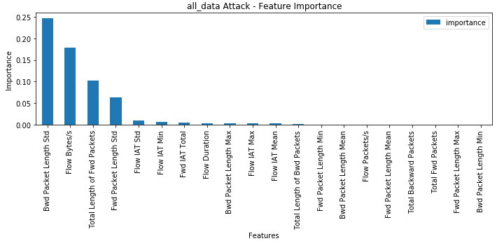
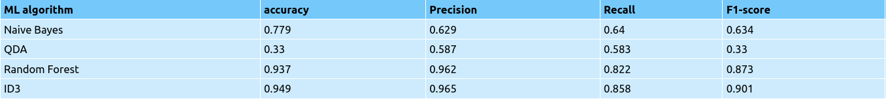

# Paper Summary
---
## Methodology

- **Dataset**: CIC-IDS2017 created  by  the  Canadian  Institute  for  Cybersecurity  at  the  University  of  New 
Brunswick. This dataset consists of a 5-day (3rd July- 7th July 2017) data stream on a network 
created by computers using up-to-date operating systems such as Windows Vista / 7 / 8.1 / 10, 
Mac, Ubuntu 12/16 and Kali. 
- **Models**:
  - Naive Bayes
  - Quadratic Discriminant Analysis (QDA)
  - Random Forest
  - Iterative Dichotomiser 3 (ID3)
- **Libraries**: Pandas, Scikit Learn, NumPy

## Dataset Information

- **Total Features**: 85
- **Selected Features for All Data**: The Random Forest Regressor from Scikit-Learn was used to determine the feature weights.

  

### Types of Attacks Targeted

| Attack    | Feature |
| -------- | ------- |
| Bot|Bwd Packet Length Mean, Flow IAT Max, Flow Duration ,Flow IAT Min, Label|
| DDoS|Bwd Packet Length Std, Total Backward Packets, Fwd IAT Total,Flow Duration, Label|
| DoS GoldenEye|Flow IAT Max, Bwd Packet Length Std, Flow IAT Min, Total Backward Packets, Label|
| DoS Hulk|Flow IAT Mean, Fwd Packet Length Min, Bwd Packet Length Mean, Total Length of Bwd Packets, Label|
| DoS slowloris|Flow IAT Mean,Total Length of Bwd Packets ,Bwd Packet Length Mean, Total Fwd Packets, Label|
| FTP-Patator|Fwd Packet Length Max, Fwd Packet Length Std, Fwd Packet Length Mean, Bwd Packet Length Std, Label|
| Heartbleed|Total Backward Packets, Fwd Packet Length Max, Flow IAT Min, Bwd Packet Length Max, Label|
|Infiltration|Fwd Packet Length Max, Fwd Packet Length Mean, Flow Duration, Total Length of Fwd Packets, Label|
|PortScan|Flow Bytes/s,Total Length of Fwd Packets, Fwd IAT Total, Flow Duration, Label|
|SSH-Patator|Fwd Packet Length Max, Flow Duration, Flow IAT Max,Total Length of Fwd Packets, Label|
|Web Attack|Bwd Packet Length Std, Total Length of Fwd Packets, Flow Bytes/s, Flow IAT Max, Label|

## Perfromance Metrics
- **Accuracy**: The ratio of successfully categorized data to total data.
- **Recall (Sensitivity)**: The ratio of data classified as an attack to all attack data.
- **Precision**: The ratio of successful classified data as the attack to all data classified as the attack.
- **F-measure (F-score/F1-score)**: The harmonic-mean of sensitivity and precision. This metric is used to express the overall success.

  

